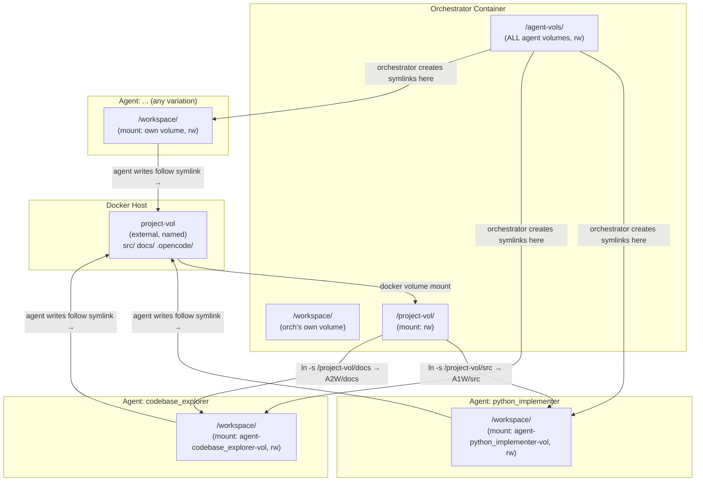
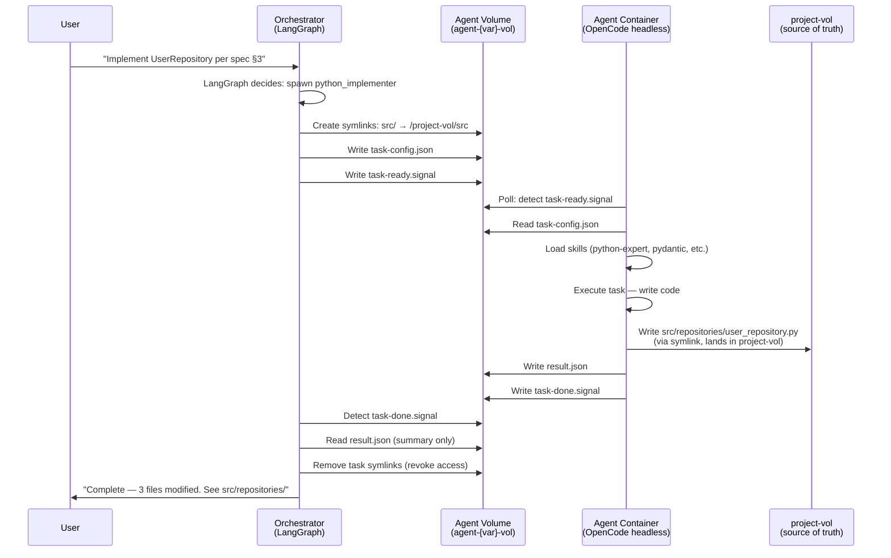
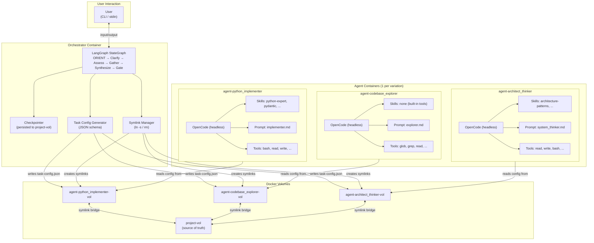

## 6. Context Injection

### 6.1 Mechanism

The orchestrator writes a JSON config file to the agent's volume before dispatching a task. The agent container reads this config on startup or when polling for tasks. No API calls, no network communication — pure file-based handoff.

### 6.2 Config File Location

```
/agent-vols/{variation}/workspace/task-config.json
```

Written by: orchestrator container
Read by: agent container (at `/workspace/task-config.json`)

### 6.3 Config Schema

```json
{
  "$schema": "task-config-v1",
  "task_id": "uuid-v4",
  "variation": "python_implementer",
  "base_type": "implementer",
  "model": "deepseek-v4-flash",
  "skills": [
    "python-expert",
    "python-best-practices",
    "pydantic",
    "python-type-safety"
  ],
  "context_files": [
    "docs/context/constraints.md",
    "docs/context/conventions.md",
    "docs/context/stack.md",
    "docs/specs/feature-x.md"
  ],
  "task": {
    "description": "Implement the UserRepository class per spec §3.1-3.3",
    "read_boundaries": {
      "allow": ["docs/specs/feature-x.md", "docs/context/*", "src/models/*.py"],
      "deny": ["docs/briefs/*", "docs/exploration/*", "*.env"]
    },
    "write_boundaries": {
      "allow": ["src/repositories/user_repository.py", "src/tests/test_user_repository.py"],
      "deny": ["src/services/*", "src/models/*"]
    }
  },
  "environment": {
    "python_binary": "/app/.venv/bin/python",
    "test_runner": "/app/.venv/bin/python -m pytest",
    "workdir": "/workspace",
    "import_style": "relative within packages",
    "package_manager": "uv"
  },
  "symlinks": {
    "src/": "/project-vol/src",
    "docs/": "/project-vol/docs",
    ".opencode/": "/project-vol/.opencode"
  },
  "output": {
    "format": "summary",
    "max_bullets": 3,
    "return_to": "orchestrator"
  },
  "timing": {
    "created_at": "2026-05-08T14:30:00Z",
    "expires_at": "2026-05-08T15:30:00Z",
    "priority": "normal"
  }
}
```

### 6.4 Field Descriptions

| Field | Required | Description |
|-------|----------|-------------|
| `task_id` | Yes | UUID v4, unique per task. Used for result correlation. |
| `variation` | Yes | One of the 9 variation names. |
| `base_type` | Yes | Core agent type (system_thinker, implementer, auditor, explorer). |
| `model` | Yes | Model to use for LLM calls (e.g., `deepseek-v4-flash`). |
| `skills` | Yes | List of skill names to load at spawn. |
| `context_files` | Yes | List of file paths (relative to project-vol) the agent should read. |
| `task.description` | Yes | 1-3 sentence human-readable task summary. |
| `task.read_boundaries` | Yes | Glob patterns for files the agent MAY read. |
| `task.write_boundaries` | Yes | Glob patterns for files the agent MAY write. |
| `environment` | Yes | Runtime context: Python binary path, test runner, workdir, import style. |
| `symlinks` | No | Map of workspace paths → project-vol targets. For agent awareness only — symlinks are already created by orchestrator. |
| `output` | Yes | Output format specification (summary, max bullets, return target). |
| `timing` | No | Task metadata: creation time, expiry, priority. |

### 6.5 How the Agent Reads Config

Two patterns, depending on task dispatch model:

**Pattern A: Polling loop (agent polls for new tasks)**
```
while true; do
  if [ -f /workspace/task-config.json ]; then
    # Read config, execute task, write results, delete config
    execute_task /workspace/task-config.json
    rm /workspace/task-config.json
  fi
  sleep 5
done
```

**Pattern B: Signal file (orchestrator writes a trigger)**
```
# Orchestrator writes config, then creates signal file:
echo "ready" > /agent-vols/{variation}/workspace/task-ready.signal

# Agent watches for signal:
inotifywait -e create /workspace/task-ready.signal
execute_task /workspace/task-config.json
```

**Recommended:** Pattern B (signal files) for lower latency. The orchestrator writes the full config, then creates a small signal file. The agent uses `inotifywait` or a polling loop.

### 6.6 Result Collection

Agent writes results to its workspace, then the orchestrator reads from the agent volume:

```
Agent writes:   /workspace/result.json → /agent-vols/{variation}/workspace/result.json
Agent signals:  echo "done" > /workspace/task-done.signal
Orchestrator reads: /agent-vols/{variation}/workspace/result.json
```

Files generated by the agent at symlinked paths (e.g., `src/repositories/user_repository.py`) flow through the symlink into `project-vol` automatically — no result collection needed for those.


## 7. Container Lifecycle

### 7.1 Startup Sequence

```
1. docker compose up -d
2. All containers start (orchestrator + all active agent variations)
3. Each container runs CMD ["sleep", "infinity"] — stays alive
4. Agent containers write a readiness file:
   echo "$(date -Iseconds)" > /workspace/agent-ready.signal
5. Orchestrator polls for readiness files before dispatching tasks:
   ls /agent-vols/*/workspace/agent-ready.signal
6. System is ready for user input
```

### 7.2 Readiness Check

| Method | Pros | Cons |
|--------|------|------|
| **Signal file** (recommended) | Simple, no HTTP needed, file-based | Requires polling by orchestrator |
| **Docker healthcheck** | Docker-native, `docker ps` shows health | Adds `curl` dependency, HTTP overhead |
| **TCP port** | Docker-native | Agents don't run servers |

**Recommended pattern:** Signal file + polling. The orchestrator checks for `/agent-vols/{variation}/workspace/agent-ready.signal` before dispatching. Agent writes this file at the end of its startup script (after Flox env is activated, venv is ready).

### 7.3 Task Dispatch Flow

```
Orchestrator decides to spawn agent (e.g., python_implementer)
    │
    ├─► 1. Creates symlinks for task-specific files
    │     ln -s /project-vol/docs/specs/foo.md /agent-vols/python_implementer/workspace/foo.md
    │     ln -s /project-vol/src /agent-vols/python_implementer/workspace/src
    │
    ├─► 2. Writes task-config.json to agent volume
    │     echo '{"task_id":"...","variation":"..."}' > /agent-vols/python_implementer/workspace/task-config.json
    │
    ├─► 3. Creates signal file
    │     echo "ready" > /agent-vols/python_implementer/workspace/task-ready.signal
    │
    ├─► 4. Agent detects signal → reads config → loads skills → executes task
    │     (Agent writes code/analysis to workspace, following symlinks to project-vol)
    │
    ├─► 5. Agent writes result.json + task-done.signal
    │     echo '{"status":"complete","summary":"..."}' > /workspace/result.json
    │     echo "done" > /workspace/task-done.signal
    │
    ├─► 6. Orchestrator detects task-done.signal → reads result.json
    │     cat /agent-vols/python_implementer/workspace/result.json
    │
    └─► 7. Orchestrator removes task-specific symlinks (revoke access)
        rm /agent-vols/python_implementer/workspace/foo.md
        rm /agent-vols/python_implementer/workspace/src
        rm /agent-vols/python_implementer/workspace/task-config.json
```

### 7.4 Shutdown

- `docker compose down` stops all containers
- Volumes persist across restarts (data survives)
- `docker compose down -v` removes volumes (clean slate)

### 7.5 Idle State

Between tasks, agent containers run `sleep infinity` with no CPU consumption. The orchestrator is the only container actively running (LangGraph state machine + polling loop). Memory usage at idle: ~50-100MB per agent container (python process + sleep), well within 32GB constraint even with 10 containers.

### 7.6 Concurrency

**One task per agent at a time.** The orchestrator checks `task-done.signal` before dispatching a new task. If an agent is busy, the orchestrator queues the task or spawns a thinker first (since thinkers have no practical concurrency limit — they just read and write files).

For variations of the same base type (e.g., python_implementer + infra_implementer), they share the base type but run in separate containers — true parallel work is possible.

### 7.7 Failure Recovery

| Failure | Recovery |
|---------|----------|
| Agent container crashes | Docker `restart: unless-stopped` brings it back. Orchestrator detects missing `agent-ready.signal` and waits. |
| Task times out | Orchestrator checks `timing.expires_at`. If expired and no `task-done.signal`, writes `task-cancel.signal`. Agent checks for this between steps. |
| Orchestrator crashes | User restarts compose. LangGraph state persisted to project-vol, resumes from checkpoint. |
| Volume corruption | Volume is Docker-managed. `docker volume rm` + `docker compose up -d` recreates it. `project-vol` is external — user manages independently. |


## 8. OpenCode + LangGraph Coexistence

**This is the most consequential architectural decision of the overhaul.** Two frameworks must coexist: OpenCode (the current agent execution framework) and LangGraph (the planned orchestrator state machine). This section defines what each framework owns and presents two viable coexistence architectures.

### 8.1 What Each Framework Provides

| Capability | OpenCode | LangGraph |
|-----------|----------|-----------|
| LLM call routing (model selection, API calls) | ✓ (opencode.jsonc models) | Via LangChain models |
| Tool execution (bash, read, write, glob, grep) | ✓ (permission system) | Via LangChain tools |
| Skill loading (SKILL.md injection) | ✓ (SkillsMiddleware) | Not natively |
| Prompt system (agent prompt files) | ✓ (.opencode/prompts/) | Via system messages |
| Subagent spawning | ✓ (task tool) | Via LangGraph subgraphs |
| Permission system (allow/deny/ask) | ✓ (opencode.jsonc) | Manual in nodes |
| State machine (nodes, edges, routing) | Not natively | ✓ (StateGraph) |
| Human-in-the-loop (interrupt/resume) | Not natively | ✓ (interrupt()) |
| Persistence (checkpointing) | Not natively | ✓ (checkpointer) |
| Streaming | Via subprocess | ✓ |
| File-based handoff protocol | Manual | Manual |
| MCP server integration | ✓ (opencode.jsonc mcp) | Via LangChain MCP tools |

### 8.2 The Core Question

**Does LangGraph replace OpenCode for the orchestrator, or do they coexist as layers?**

Currently:
- The orchestrator IS an OpenCode agent (mode: "primary")
- It spawns subagents via OpenCode's `task` tool
- Skills, prompts, permissions all flow through OpenCode
- The user interacts directly with the OpenCode orchestrator

The desired state:
- LangGraph manages orchestrator state and decision flow
- Agents run in Docker containers, not OpenCode subprocesses
- File-based handoff replaces in-process delegation

### 8.3 Approach A: LangGraph Orchestrator + OpenCode Headless Agents ("Clean Separation")

```
┌──────────────────────────────────────────────────────────────┐
│ USER                                                         │
│  │  (interacts via CLI / API)                                │
│  ▼                                                           │
│ ┌──────────────────────────────────────┐                     │
│ │ LangGraph Orchestrator (Python proc) │                     │
│ │  - StateGraph: ORIENT→Clarify→...    │                     │
│ │  - Human-in-the-loop gates           │                     │
│ │  - Checkpointer for session state    │                     │
│ │  - Symlink bridge management         │                     │
│ │  - Task config generation            │                     │
│ │  - Reads: summaries, result.json     │                     │
│ └──────────┬───────────────────────────┘                     │
│            │ writes task-config.json + signal files           │
│            ▼                                                 │
│ ┌──────────────────────────────────────┐                     │
│ │ Agent Container (e.g., python_impl)  │                     │
│ │  ┌────────────────────────────────┐  │                     │
│ │  │ OpenCode (headless)            │  │                     │
│ │  │  - Reads task-config.json      │  │                     │
│ │  │  - Loads skills from .opencode │  │                     │
│ │  │  - Uses prompts, tools, models │  │                     │
│ │  │  - Writes result.json          │  │                     │
│ │  │  - Writes code via symlinks    │  │                     │
│ │  └────────────────────────────────┘  │                     │
│ └──────────────────────────────────────┘                     │
└──────────────────────────────────────────────────────────────┘
```

**What runs where:**

| Component | Runs In | Framework |
|-----------|---------|-----------|
| Orchestrator decision flow | orchestrator container | LangGraph (Python) |
| User interaction | orchestrator container | LangGraph + CLI |
| Agent task execution | agent container | OpenCode (headless) |
| Skill loading | agent container | OpenCode SkillsMiddleware |
| Prompt system | agent container | OpenCode (.opencode/prompts/) |
| State persistence | orchestrator container | LangGraph checkpointer |
| File-based handoff | Between containers | Files on volumes |

**Pros:**
- Clean separation of concerns: LangGraph = orchestration, OpenCode = execution
- Each framework does what it's best at
- LangGraph is a standard Python application (easy to develop, test, debug)
- OpenCode's prompt/skill/tool system is fully preserved and leveraged
- The orchestrator is NOT an OpenCode agent — no conflict of identity
- LangGraph's human-in-the-loop integrates naturally with approval gates

**Cons:**
- The orchestrator is completely rewritten (from OpenCode agent → LangGraph Python app)
- Two codebases to maintain (LangGraph orchestrator + OpenCode agent config)
- The current OpenCode orchestrator prompt and config become dead code
- Must implement user interaction in LangGraph (CLI, input handling)
- LangGraph orchestrator needs its own model calls for decision-making
- OpenCode headless mode may not be officially supported or documented
- Integration risk: can OpenCode run truly headless with file-based I/O?

**Open questions for this approach:**
1. Can OpenCode run in a fully headless, non-interactive mode? (CLI flag needed)
2. Does OpenCode support reading task context from a file rather than stdin?
3. How does the orchestrator (LangGraph) call LLMs for its own reasoning? Via LangChain models? Which model?
4. What does user interaction look like? A CLI readline loop? A web UI? Stdin/stdout?

### 8.4 Approach B: LangGraph as OpenCode Tool ("Minimal Disruption")

```
┌──────────────────────────────────────────────────────────────┐
│ USER                                                         │
│  │  (interacts exactly as today — through OpenCode)          │
│  ▼                                                           │
│ ┌──────────────────────────────────────┐                     │
│ │ OpenCode Orchestrator (mode:primary) │                     │
│ │  - Same prompt, same skills          │                     │
│ │  - User interacts as before          │                     │
│ │  ┌────────────────────────────────┐  │                     │
│ │  │ LangGraph (embedded library)   │  │                     │
│ │  │  - Called as a tool:           │  │                     │
│ │  │    dispatch_task(variation,..)  │  │                     │
│ │  │  - State tracking in background │  │                     │
│ │  │  - Approval gate integration    │  │                     │
│ │  └────────────────────────────────┘  │                     │
│ │  - Writes task-config.json           │                     │
│ │  - Manages symlinks                  │                     │
│ └──────────┬───────────────────────────┘                     │
│            │ writes files to agent volumes                    │
│            ▼                                                 │
│ ┌──────────────────────────────────────┐                     │
│ │ Agent Container (e.g., python_impl)  │                     │
│ │  ┌────────────────────────────────┐  │                     │
│ │  │ OpenCode (headless)            │  │                     │
│ │  │  (same as Approach A)          │  │                     │
│ │  └────────────────────────────────┘  │                     │
│ └──────────────────────────────────────┘                     │
└──────────────────────────────────────────────────────────────┘
```

**What runs where:**

| Component | Runs In | Framework |
|-----------|---------|-----------|
| Orchestrator (user-facing) | orchestrator container | OpenCode (mode: primary) |
| State management | orchestrator container | LangGraph (embedded Python lib) |
| Agent task execution | agent container | OpenCode (headless) |
| Everything else | same as Approach A | same as Approach A |

**Pros:**
- Minimal disruption — the orchestrator remains an OpenCode agent
- User experience unchanged (same OpenCode CLI interaction)
- Existing orchestrator prompt and config are preserved and extended
- OpenCode handles all LLM calls for the orchestrator (model routing already configured)
- Human-in-the-loop flows through OpenCode's approval system, not a new UI
- Lower integration risk — LangGraph is "just a Python library" called from within OpenCode

**Cons:**
- Architectural layering is muddy — OpenCode wraps LangGraph, which wraps OpenCode agents
- The orchestrator has TWO state systems: OpenCode's context window + LangGraph's checkpointer
- Harder to reason about: "who is in charge?" when both frameworks are active at the orchestrator level
- OpenCode's permission system may interfere with LangGraph's file operations
- LangGraph is embedded, not standalone — harder to test independently
- The orchestrator's context window gets used for both user interaction AND state management
- Violates the "prompts stay generic" principle — orchestrator prompt must know about LangGraph

**Open questions for this approach:**
1. How does OpenCode call into a Python LangGraph library? Via bash tool (`python -c "..."`)? Or a proper Python tool?
2. Does the LangGraph checkpointer survive across OpenCode sessions?
3. If OpenCode is the orchestrator, does it still run in a container? Or remain on the host?

### 8.5 Trade-off Summary

| Dimension | Approach A (LangGraph Orch) | Approach B (OpenCode Orch + LG lib) |
|-----------|----------------------------|-------------------------------------|
| **Clean separation** | ✓ Clear layers | ✗ Intertwined |
| **Preserves existing work** | ✗ Orch prompt/config replaced | ✓ Orch prompt/config preserved |
| **User experience** | Requires new UI/work | Unchanged (OpenCode CLI) |
| **Development complexity** | Higher (new LangGraph app) | Medium (LangGraph as library) |
| **Testing** | Easy (standard Python app) | Harder (embedded in OpenCode) |
| **Integration risk** | Medium (headless OpenCode) | Low (OpenCode stays primary) |
| **State management clarity** | ✓ Single source of truth (LG) | ✗ Dual state (OC context + LG) |
| **Skill/prompt reuse** | ✓ Full (agent containers) | ✓ Full (agent containers) |
| **Approval gates** | LangGraph interrupt() | OpenCode permission system |
| **Model usage** | LangChain models for orch | OpenCode model for orch |
| **Long-term viability** | Better — independent layers | Fragile — tight coupling |

### 8.6 Hybrid Option: Approach C — Deep Agents as Orchestrator

A third approach uses **Deep Agents** (the framework built on LangGraph) as the orchestrator. Deep Agents provides planning (TodoListMiddleware), file management (FilesystemMiddleware), subagent delegation (SubAgentMiddleware), and skill loading (SkillsMiddleware) out of the box — capabilities that map directly to the orchestrator's needs.

```
Deep Agents Orchestrator (runs in orchestrator container)
  ├── TodoListMiddleware: break user goal into phases
  ├── SubAgentMiddleware: delegate to agent containers
  │     └── Custom subagents that write/read task-config.json
  ├── FilesystemMiddleware: manage symlink bridge
  ├── SkillsMiddleware: load orchestrator skills
  └── HumanInTheLoopMiddleware: approval gates
```

Agent containers still run OpenCode headless. The orchestrator uses Deep Agents because it provides the middleware layer between the user and agent containers — planning, file ops, and subagent dispatch are built-in. Less code to write than Approach A, cleaner separation than Approach B.

### 8.7 Recommendation

**Approach A (LangGraph Orchestrator + OpenCode Headless Agents)** is recommended for its clean separation of concerns. However, it requires answering the open questions in §8.3 before proceeding:

- **Can OpenCode run headless?** This is a binary gate. If no, Approach A is not viable.
- **How does the orchestrator interact with the user?** A simple CLI loop? A web interface? This affects the entire UX design.
- **Which model drives the orchestrator's reasoning?** GLM-5.1 is assigned to the orchestrator; does it run via LangChain or remain in OpenCode?

**If headless OpenCode is not feasible**, fall back to Approach B (LangGraph embedded in the OpenCode orchestrator) or Approach C (Deep Agents as orchestrator, which may handle agent dispatch differently).

### 8.8 What Does NOT Change Regardless of Approach

- Agent containers always run OpenCode headless (or equivalent agent runner)
- File-based handoff protocol (config JSON + signal files) remains the same
- Symlink bridge mechanics remain the same
- Docker volume topology remains the same
- Flox + uv environment management remains the same
- Per-variation skills and prompts are preserved in `.opencode/`

Only the **orchestrator's runtime** changes between approaches.


## 9. Diagrams

### 9.1 Volume Topology



### 9.2 Task Dispatch Flow



### 9.3 OpenCode + LangGraph Relationship (Approach A)




## 10. Decisions Required

These decisions must be made by the user before proceeding to Phase 3 (LangGraph State Management) and Phase 6 (Implementation).

### 10.1 OpenCode + LangGraph Architecture (CRITICAL — Binary Gate)

**D-001: Which coexistence approach?**

| Option | Implication |
|--------|------------|
| **Approach A:** LangGraph as standalone orchestrator | Rewrite orchestrator. OpenCode runs headless on agents. Clean separation. |
| **Approach B:** LangGraph embedded in OpenCode orchestrator | Preserve current orchestrator. LangGraph as a library. Muddy layering. |
| **Approach C:** Deep Agents as orchestrator | Middleware handles planning/files/delegation. Agent containers run OpenCode. |

**Requirement before choosing:** Must verify OpenCode can run headless (non-interactive, file-based I/O). If not, Approach A is not viable.

### 10.2 Headless OpenCode Feasibility (Gating Question)

**D-002: Can OpenCode run in a fully headless mode?**

This is the single most important technical question for the entire container architecture. Must verify:

- Can OpenCode be invoked without an interactive TTY?
- Can it read task input from a file (not stdin)?
- Can it write output to a file (not stdout)?
- Can it run within `sleep infinity` containers where it's invoked on-demand or polls for tasks?
- What is the CLI command for headless execution? (e.g., `opencode run --input task.json --output result.json`)

If headless OpenCode is NOT feasible, the architecture must pivot to a custom agent runner that replicates OpenCode's prompt/skill/tool system, or adopt a different agent framework entirely (e.g., LangChain agents in each container).

### 10.3 MVP Agent Set

**D-003: Which variations are active in MVP?**

The compose file defines 10 services (1 orchestrator + 9 agents). For MVP, the user may want fewer:

| MVP Option | Active Containers | RAM (idle) |
|-----------|-------------------|------------|
| **Full** | 10 | ~1 GB |
| **Core** | Orchestrator + python_implementer + codebase_explorer | ~300 MB |
| **Minimal** | Orchestrator + python_implementer | ~200 MB |

### 10.4 Orchestrator Model

**D-004: Which model drives the orchestrator's reasoning?**

| Model | Where It Runs | RAM | Context |
|-------|--------------|-----|---------|
| GLM-5.1 (assigned) | Via ? (LangChain or OpenCode) | ~8 GB at full context | 600+ tool calls endurance |
| Qwen 3.6 Plus | Via OpenCode | ~4 GB | 1M token window |
| A smaller model | Via Ollama | ~2 GB | Faster, lower quality |

Note: The orchestrator never reads full content — only summaries. A smaller model may suffice for routing decisions.

### 10.5 Task Dispatch Mechanism

**D-005: Signal files or HTTP API for task dispatch?**

| Mechanism | Pros | Cons |
|-----------|------|------|
| **Signal files** (current design) | Simple, file-based, no network code | Polling loop adds latency (~5s max) |
| **HTTP API** | Real-time dispatch | Agents need HTTP servers, more code |
| **inotify / filesystem watcher** | Near-real-time, no polling | Linux-only, complex error handling |

### 10.6 Flox vs apt Fallback

**D-006: What if a dependency is NOT in Flox?**

Current design: if a tool isn't in Flox catalog, install it via apt in the Dockerfile (as fallback). Must decide the threshold — how many apt packages before it's simpler to just use apt for everything? Currently only 1 identified gap (opencode-cli), installed via bun.

### 10.7 OpenCode CLI Installation

**D-007: How is OpenCode installed in agent containers?**

| Option | Size Impact | Complexity |
|--------|------------|------------|
| `bun install -g @anthropic-ai/claude-code` in Dockerfile | +50 MB | Low |
| Prebuilt binary layer | +0 MB (shared layer) | Medium |
| Volume mount from host | +0 MB | Violates "no host access" |

### 10.8 User Interaction Model (for Approach A)

**D-008: How does the user interact with a LangGraph orchestrator?**

If Approach A is chosen, the orchestrator is no longer an OpenCode agent — it's a standalone LangGraph Python application. Options:

- **REPL loop:** stdin/stdout readline interface
- **Web UI:** Simple web interface on port 8000
- **File-based:** User writes goal to a file, orchestrator reads it, writes results to a file
- **MCP server:** Orchestrator exposes an MCP server; user connects via OpenCode or another client

### 10.9 Volume Naming Convention

**D-009: Confirm volume naming pattern `agent-{variation}-vol`?**

Current proposal: `agent-python_implementer-vol`, `agent-codebase_explorer-vol`, etc. This uses underscores in variation names (matching the variation matrix). Docker volume names are case-sensitive. Alternative: hyphens (`agent-python-implementer-vol`).

### 10.10 Multi-Project Support

**D-010: One project-vol or multiple?**

Current design assumes one `project-vol` (one project). For multi-project support, the orchestrator would need to manage multiple external volumes or a single volume with project subdirectories. Defer to a future phase.

